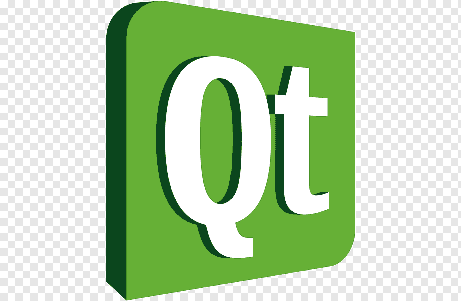
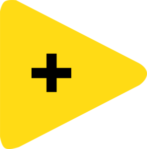

  

<h1 align="center">Hello! You got my account, so let`s get acquainted😉</h1>

<h3 align="left">👩‍💻  About myself:</h3>

###

My name is Zhenya. I want to be an IT specialist. I am interested in several specialties, such as:

 1️⃣ software development. At the moment I have experience in programming in such programming languages as C, C++, C#, Python and LabView  (this is a graphical programming language), working with SQLite and PostgreSQL databases. I like to program and often I use programming for some tasks.
 

 2️⃣ cybersecurity. As for me, this is the most interesting field in IT, because you should have different skills in fields such as cryptography, operating system administration, network building. I`m fond of cryptography. If be honest, it was one of my favorite technical subjects in the university.
 

 3️⃣ DataScience. I like this speciality, because it`s include programming and math. I have mentioned that i like programming, so my favorite language is Python. Also I have experience with Pandas and NumPy, which are connected with DataScience. Also I`m keen on math. I always had the best marks. I think that math is the queen of sciences.

<h3 align="left">🛠 My experience:</h3>

###

  
  
  
  
    
  
  
  
  
  
  
  
  
  
  
    

###

